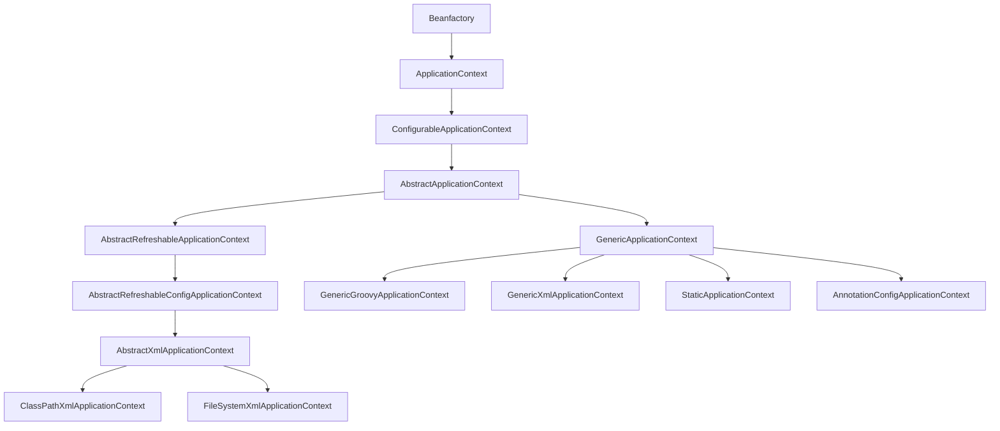

# Chapter 2 : 스프링 코어

- [Chapter 2 : 스프링 코어](#chapter-2--스프링-코어)
  - [레시피 2-1 : 자바로 POJO 구성하기](#레시피-2-1--자바로-pojo-구성하기)
    - [build.gradle 문제](#buildgradle-문제)
      - [`java` 플러그인 추가](#java-플러그인-추가)
      - [`repositories` 추가](#repositories-추가)
      - [`version` 추가](#version-추가)
      - [`gradle` 버전 변경](#gradle-버전-변경)
    - [IoC 컨테이너](#ioc-컨테이너)
      - [ApplicationContext](#applicationcontext)
      - [getBean()](#getbean)
    - [`@Configuration`과 `@Bean`](#configuration과-bean)

## 레시피 2-1 : 자바로 POJO 구성하기

이 책에서 말하는 POJO는 스프링 `빈`(`Bean`)을 의미한다.

### build.gradle 문제

`build.gradle`에 문제가 있어서 빌드가 되지 않는 문제가 있었다.

다음은 예제 코드에서 주어진 `build.gradle` 파일이다.

```groovy
dependencies {
    compile group: 'org.springframework', name: 'spring-context'
}

jar {
    manifest.attributes('Main-Class': 'com.apress.springrecipes.sequence.Main')
}
```

#### `java` 플러그인 추가

다음은 위 코드를 빌드했을 때 발생한 오류 메시지이다.

```shell
Build file '/Users/jeongwpa/projects/spring-study/yhames/spring5recipeChapter2/recipe_2_1_i/build.gradle' line: 3

A problem occurred evaluating root project 'recipe_2_1_i'.
> Could not find method compile() for arguments [{group=org.springframework, name=spring-context}] on object of type org.gradle.api.internal.artifacts.dsl.dependencies.DefaultDependencyHandler.

* Try:
Run with --info or --debug option to get more log output.
# ...
```

`compile()` 함수를 찾지 못했기 때문에 오류가 발생한 것으로 보인다.

따라서 `java` 플러그인을 추가했다.

```groovy
plugins {
    id 'java'
}

dependencies {
    compile group: 'org.springframework', name: 'spring-context'
}

jar {
    manifest.attributes('Main-Class': 'com.apress.springrecipes.sequence.Main')
}
```

#### `repositories` 추가

이후에 다음과 같은 오류가 발생했다.

```shell
recipe_2_1_i:main: Cannot resolve external dependency org.springframework:spring-context: because no repositories are defined.

Possible solution:
 - Declare repository providing the artifact, see the documentation at https://docs.gradle.org/current/userguide/declaring_repositories.html
```

`repositoies`가 정의되어 있지 않아서 발생한 오류로 보인다.

따라서 `repositories`를 추가했다.

```groovy
plugins {
    id 'java'
}

repositories {
    mavenCentral()
}

dependencies {
    compile group: 'org.springframework', name: 'spring-context'
}

jar {
    manifest.attributes('Main-Class': 'com.apress.springrecipes.sequence.Main')
}
```

#### `version` 추가

하지만 여전히 다음과 같은 오류가 발생했다.

```shell
recipe_2_1_i:main: Could not find org.springframework:spring-context:.

Possible solution:
 - Declare repository providing the artifact, see the documentation at https://docs.gradle.org/current/userguide/declaring_repositories.html
```

오류 메시지를 보면 `org.springframework:spring-context:.`를 찾지 못했다고 나온다.

버전을 명시하지 않아서 발생한 오류인 것으로 생각되어 버전을 명시했다.

```groovy
plugins {
    id 'java'
}

repositories {
    mavenCentral()
}

dependencies {
    compile group: 'org.springframework', name: 'spring-context', version: '5.3.32'
}

jar {
    manifest.attributes('Main-Class': 'com.apress.springrecipes.sequence.Main')
}
```

#### `gradle` 버전 변경

빌드는 성공했지만 다음과 같은 경고 메시지가 발생했다.

```shell
The project uses Gradle 3.3.
The support for Gradle older that 4.5 will likely be dropped by IntelliJ IDEA in the next release.

Gradle 4.5 release notes can be found at https://docs.gradle.org/4.5/release-notes.html

Possible solution:
 - Open Gradle wrapper settings, change `distributionUrl` property to use Gradle 4.5 or newer and reload the project

```

`Gradle` 최소 `4.5` 이상을 권장하고 있다.

따라서 `gradle/wrapper/gradle-wrapper.properties`에서 `Gradle` 버전을 변경했다.

```properties
#Tue Jan 24 10:04:22 CET 2017
distributionBase=GRADLE_USER_HOME
distributionPath=wrapper/dists
zipStoreBase=GRADLE_USER_HOME
zipStorePath=wrapper/dists
#distributionUrl=https\://services.gradle.org/distributions/gradle-3.3-bin.zip
distributionUrl=https\://services.gradle.org/distributions/gradle-4.5-bin.zip   # 현재 사용중인 버전은 8.6이다.
```

gradle 버전을 변경하니 드디어 빌드에 성공했다.

```shell
Download https://services.gradle.org/distributions/gradle-4.5-bin.zip, took 4 s 935 ms (72.42 MB)
Starting Gradle Daemon...
Gradle Daemon started in 681 ms

CONFIGURE SUCCESSFUL in 11s
```

### IoC 컨테이너

`IoC 컨테이너`에는 `BeanFactory`와 `ApplicationContext`가 있다.

`BeanFactory`는 가장 기본적인 `IoC 컨테이너`이고, `ApplicationContext`는 `BeanFactory`를 상속받아 확장한 인터페이스이다.


`ApplicationContext`는 `BeanFactory`의 기능을 포함하며, 추가적인 기능을 제공한다.

#### ApplicationContext

`ApplicationContext`에는 `AnnotationConfigApplicationContext`를 제외하고 `XML`, `JavaConfig`, `GroovyConfig` 등 다양한 설정 방법이 있다. 




여기서는 `AnnotationConfigApplicationContext`을 사용한다.

#### getBean()

등록한 `POJO`(`빈`)을 가져오기 위해서는 `getBean()` 메서드를 사용해서 가져와야한다.

`BeanFactory`에 정의된 `getBean()` 메서드는 다음과 같이 정의되어 있다.

```java
public interface BeanFactory {
    // ...

	Object getBean(String name) throws BeansException;

	<T> T getBean(String name, Class<T> requiredType) throws BeansException;

	Object getBean(String name, Object... args) throws BeansException;

	<T> T getBean(Class<T> requiredType) throws BeansException;

	<T> T getBean(Class<T> requiredType, Object... args) throws BeansException;

    //...
}
```

기본적으로 `등록된 빈의 이름`을 사용하며, 해당 클래스로 등록된 빈이 **오직 1개**라면 이름을 생략하고 `클래스 정보`만으로 가져올 수 있다.


### `@Configuration`과 `@Bean`


